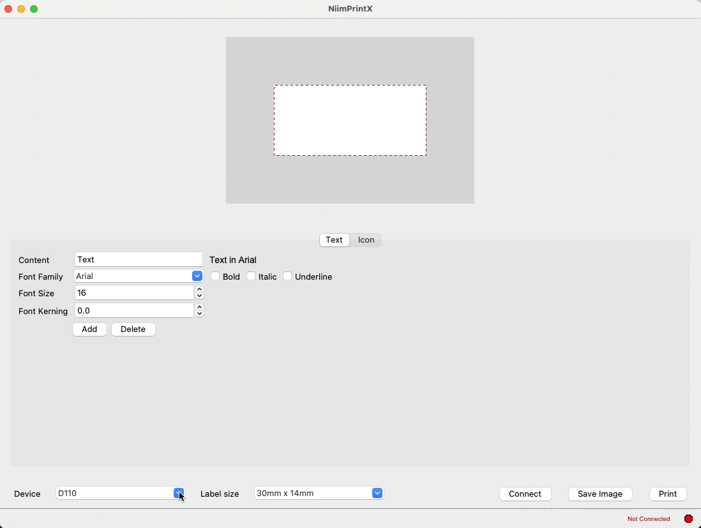

<h1 align="center">NiimPrintX</h1>
<p align="center">
<a href="https://github.com/labbots/NiimPrintX/releases"></a>
<a href="https://github.com/labbots/NiimPrintX/actions/workflows/tag.yaml"></a>
<a href="https://github.com/labbots/NiimPrintX/commits/main/"></a>
</p>




NiimPrintX is a Python library designed to seamlessly interface with NiimBot label printers via Bluetooth. 
It provides both a Command-Line Interface (CLI) and a Graphical User Interface (GUI) for users to design and print labels efficiently.

## Key Features
* **Cross-Platform Compatibility:** NiimPrintX works on Windows, macOS, and Linux, ensuring broad usability.
* **Bluetooth Connectivity:** Effortlessly connect to your NiimBot label printers via Bluetooth.
* **Comprehensive Model Support:** Compatible with multiple NiimBot printer models (D11, B21, B1, D110, B18).
* **Dual Interface Options:** Provides both Command-Line Interface (CLI) and Graphical User Interface (GUI) to suit different user preferences.
* **Custom Label Design:** The GUI app enables users to design labels tailored to specific devices and label sizes.
* **Advanced Print Settings:** Customize print density, quantity, and image rotation for precise label printing.

## Requirements
To run NiimPrintX, you need to have the following installed:

* Python 3.12 or later
* ImageMagick library
* Poetry for dependency management


## Installation
To install NiimPrintX, follow these steps:

* Ensure that ImageMagick is installed and properly configured on your system. You can download it from [here](https://imagemagick.org/script/download.php).

Clone the repository:

```shell
git clone https://github.com/labbots/NiimPrintX.git
cd NiimPrintX
```
Install the necessary dependencies using Poetry:

```shell
python -m venv venv
poetry install
```

### Note:
MacOS specific setup for local development

```shell
brew install libffi
brew install glib gobject-introspection cairo pkg-config

export PKG_CONFIG_PATH="/usr/local/opt/libffi/lib/pkgconfig"
export LDFLAGS="-L/usr/local/opt/libffi/lib"
export CFLAGS="-I/usr/local/opt/libffi/include"
```


## Usage
NiimPrintX provides both CLI and GUI applications to use the printer.

### Command-Line Interface (CLI)
The CLI allows you to print images and get information about the printer models.

#### General CLI Usage
```shell
Usage: python -m NiimPrintX.cli [OPTIONS] COMMAND [ARGS]...

Options:
  -v, --verbose  Enable verbose logging
  -h, --help     Show this message and exit.

Commands:
  info
  print
```
#### Print Command
```shell
Usage: python -m NiimPrintX.cli print [OPTIONS]

Options:
  -m, --model [b1|b18|b21|d11|d110]
                                  Niimbot printer model  [default: d110]
  -d, --density INTEGER RANGE     Print density  [default: 3; 1<=x<=5]
  -n, --quantity INTEGER          Print quantity  [default: 1]
  -r, --rotate [0|90|180|270]     Image rotation (clockwise)  [default: 0]
  --vo INTEGER                    Vertical offset in pixels  [default: 0]
  --ho INTEGER                    Horizontal offset in pixels  [default: 0]
  -i, --image PATH                Image path  [required]
  -h, --help                      Show this message and exit.
```
**Example:**

```shell
python -m NiimPrintX.cli print -m d110 -d 3 -n 1 -r 90 -i path/to/image.png
```

#### Info Command

```shell
Usage: python -m NiimPrintX.cli info [OPTIONS]

Options:
  -m, --model [b1|b18|b21|d11|d110]
                                  Niimbot printer model  [default: d110]
  -h, --help                      Show this message and exit.
```

**Example:**

```shell
python -m NiimPrintX.cli info -m d110
```

### Graphical User Interface (GUI)
The GUI application allows users to design labels based on the label device and label size. Simply run the GUI application:

```shell
python -m NiimPrintX.ui
```

## Contributing
Contributions are welcome! Please fork the repository and submit a pull request with your improvements.

## Credits
* Icons made by [Dave Gandy](https://www.flaticon.com/authors/dave-gandy) from [www.flaticon.com](https://www.flaticon.com/)
* Icons made by [Pixel perfect](https://www.flaticon.com/authors/pixel-perfect) from [www.flaticon.com](https://www.flaticon.com/)
* Icons made by [Freepik](https://www.freepik.com) from [www.flaticon.com](https://www.flaticon.com/)
* Icons made by [rddrt](https://www.flaticon.com/authors/rddrt) from [www.flaticon.com](https://www.flaticon.com/)
* Icons made by [Icongeek26](https://www.flaticon.com/authors/icongeek26) from [www.flaticon.com](https://www.flaticon.com/)
* Icons made by [SyafriStudio](https://www.flaticon.com/authors/syafristudio) from [www.flaticon.com](https://www.flaticon.com/)
* Icons made by [Wahyu Adam](https://www.flaticon.com/authors/wahyu-adam) from [www.flaticon.com](https://www.flaticon.com/)
* Icons made by [meaicon](https://www.flaticon.com/authors/meaicon) from [www.flaticon.com](https://www.flaticon.com/)
* Icons made by [IconKanan](https://www.flaticon.com/authors/iconkanan) from [www.flaticon.com](https://www.flaticon.com/)
* Icons made by [kornkun](https://www.flaticon.com/authors/kornkun) from [www.flaticon.com](https://www.flaticon.com/)
* Icons made by [Rifaldi Ridha Aisy](https://www.flaticon.com/authors/rifaldi-ridha-aisy) from [www.flaticon.com](https://www.flaticon.com/)
